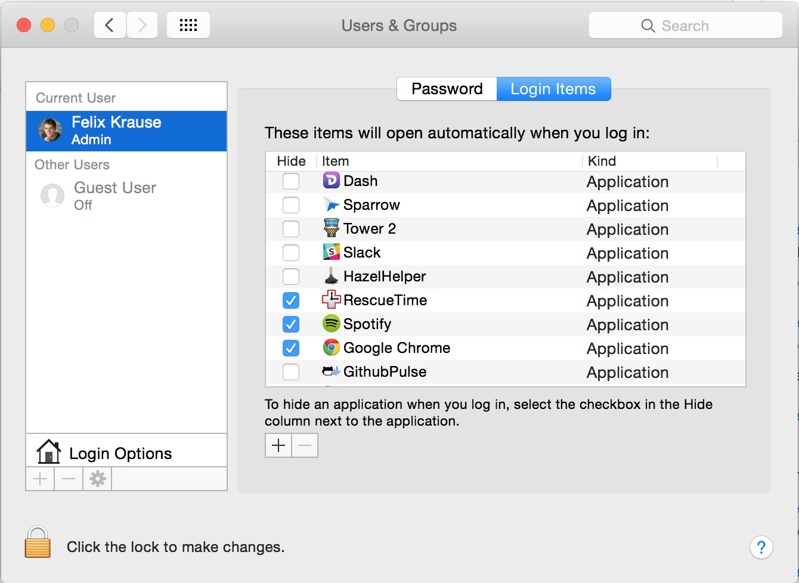
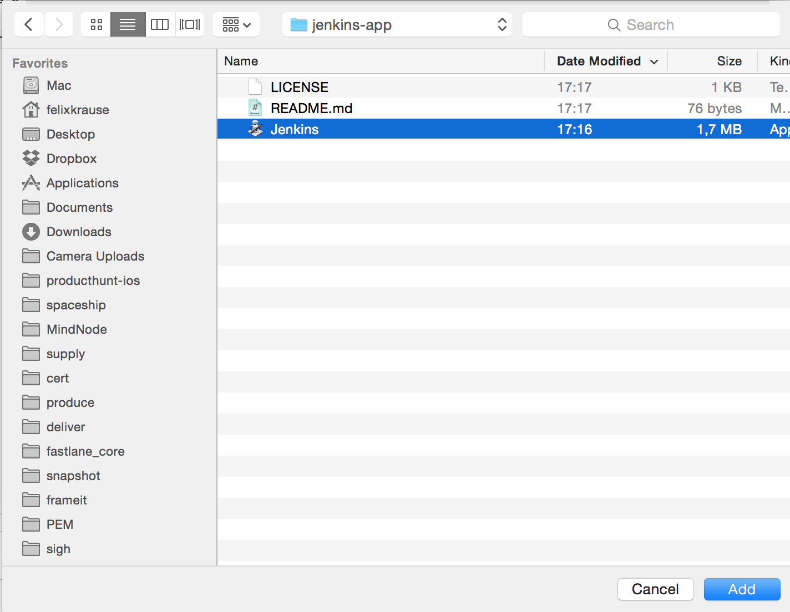

# jenkins-app
Launches brew-installed Jenkins as a user when the Mac starts

Just copy [this file] somewhere on your Mac and follow these steps:

- Open System Preferences
- Open `Users & Groups`
- Switch to `Login Items`
- Click the `+`
- Choose the Jenkins file you just downloaded

Celebrate 🎉

